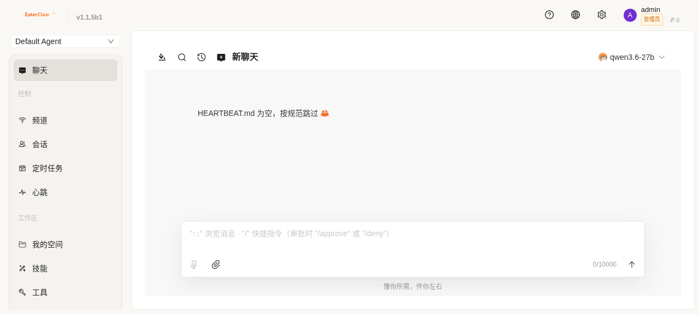

# CoApis 安装部署指南

## 📋 前置要求

### 硬件要求

| 配置 | 最低要求 | 推荐配置 |
|------|---------|---------|
| CPU | 4 核 | 8 核+ |
| 内存 | 8 GB | 16 GB+ |
| 存储 | 50 GB | 100 GB+ (SSD) |
| 网络 | 100 Mbps | 1 Gbps |

### 软件要求

- **操作系统**：Linux (Ubuntu 20.04+/CentOS 8+/Debian 11+)
- **Docker**：20.10+
- **Docker Compose**：2.0+
- **LLM 服务**：OpenAI 兼容 API（如 Ollama、vLLM、LM Studio 等）

## 🚀 快速部署（5 分钟）

### 第一步：克隆项目

```bash
git clone https://github.com/coapis/coapis.git
cd coapis-agent
```

### 第二步：配置环境变量

```bash
# 复制环境变量模板
cp docker/.env.example docker/.env

# 编辑配置文件
vim docker/.env
```

**关键配置项**：

```bash
# LLM API 服务地址（必填）
COAPIS_LLM_BASE_URL=http://your-llm-server:8082/v1

# 启用认证和用户体系（建议启用）
COAPIS_AUTH_ENABLED=True
COAPIS_USER_SYSTEM_ENABLED=True
```

### 第三步：启动服务

```bash
cd docker
docker compose up -d
```

**首次启动时**，`init_workspace.sh` 会自动：
1. 创建 `system/` 目录结构
2. 创建 `workspaces/` 目录
3. 生成默认配置文件（`config.json`, `providers.json`, `users.json` 等）
4. 创建 `.secret/` 密钥目录

### 第四步：配置 Agent 和 Provider

首次启动后，配置文件位于 `{WORKING_DIR}/system/` 下：

```bash
# 编辑 Agent 配置
vim /apps/ai/coapis/system/config.json

# 示例配置
{
  "agents": {
    "active_agent": "default",
    "profiles": {
      "default": {
        "model": "qwen3.6-27b",
        "provider": "local_llm",
        "enable_memory": false,
        "tool_calling_method": "raw"
      }
    }
  }
}

# 编辑 Provider 配置
vim /apps/ai/coapis/system/providers.json

# 示例配置
{
  "local_llm": {
    "id": "local_llm",
    "type": "openai",
    "api_base": "http://your-llm-server:8082/v1",
    "api_key": "none"
  }
}
```

修改配置后，重启服务使配置生效：
```bash
cd docker
docker compose restart server
```

### 第五步：访问前端

打开浏览器访问 `http://<服务器IP>:4200`

**首次使用**需要注册管理员账号。



*CoApis 登录界面*

## 🔧 详细配置

### LLM 服务配置

#### 使用 Ollama

```bash
# 1. 安装 Ollama
curl -fsSL https://ollama.com/install.sh | sh

# 2. 拉取模型
ollama pull qwen3.6-27b

# 3. 启动服务
ollama serve

# 4. 配置 CoApis
# docker/.env
COAPIS_LLM_BASE_URL=http://localhost:11434/v1
```

#### 使用 vLLM

```bash
# 1. 启动 vLLM 服务
vllm serve \
  --model /path/to/model \
  --tensor-parallel-size 4 \
  --max_num_seqs 8 \
  --max-model-len 131072

# 2. 配置 CoApis
# docker/.env
COAPIS_LLM_BASE_URL=http://localhost:8082/v1
```

#### 使用 OpenAI API

```bash
# docker/.env
COAPIS_LLM_BASE_URL=https://api.openai.com/v1
OPENAI_API_KEY=sk-...

# {WORKING_DIR}/system/providers.json
{
  "openai": {
    "id": "openai",
    "type": "openai",
    "api_base": "https://api.openai.com/v1",
    "api_key": "sk-..."
  }
}
```

### 用户系统配置

```bash
# docker/.env

# 积分配置
COAPIS_USER_POINTS_LOGIN_DAILY=5          # 每日登录积分
COAPIS_USER_POINTS_FIRST_LOGIN=20         # 首次登录奖励
COAPIS_USER_POINTS_CHAT_PER_SESSION=2     # 每次聊天积分

# Token 配额（每月）
COAPIS_USER_TOKEN_QUOTA_L0=100000         # L0 用户配额
COAPIS_USER_TOKEN_QUOTA_L1=1000000        # L1 用户配额
COAPIS_USER_TOKEN_QUOTA_L2=5000000        # L2 用户配额

# 限流配置（每分钟请求数）
COAPIS_USER_RATE_LIMIT_L0=10              # L0 用户限流
COAPIS_USER_RATE_LIMIT_L1=10              # L1 用户限流
COAPIS_USER_RATE_LIMIT_L2=50              # L2 用户限流
```

## 🐳 Docker 部署

### Docker Compose 配置

```yaml
version: '3.8'

services:
  server:
    build: ../server
    ports:
      - "8000:8000"
    volumes:
      - ../workspaces:/opt/coapis/workspaces
      - coapis-data:/opt/coapis/data
    environment:
      - COAPIS_LLM_BASE_URL=${COAPIS_LLM_BASE_URL}
      - COAPIS_AUTH_ENABLED=${COAPIS_AUTH_ENABLED}
    healthcheck:
      test: ["CMD", "curl", "-f", "http://localhost:8000/api/health"]
      interval: 30s
      timeout: 10s
      retries: 3
      start_period: 60s

  nginx:
    image: nginx:alpine
    ports:
      - "4200:80"
    volumes:
      - ./nginx.conf:/etc/nginx/nginx.conf:ro
      - ../client/dist:/usr/share/nginx/html:ro
    depends_on:
      server:
        condition: service_healthy

volumes:
  coapis-data:
```

### 端口说明

| 端口 | 服务 | 说明 |
|------|------|------|
| 4200 | Nginx | 前端访问入口 |
| 8000 | Backend | 后端 API（内部网络） |

## 📝 手动部署（高级用户）

### 后端部署

```bash
# 1. 安装依赖
cd server
pip install -r requirements.txt

# 2. 配置环境变量
export COAPIS_LLM_BASE_URL=http://your-llm-server:8082/v1
export COAPIS_AUTH_ENABLED=True

# 3. 启动服务
python start_backend.py
```

### 前端部署

```bash
# 1. 安装依赖
cd client
npm install

# 2. 构建生产版本
npm run build

# 3. 部署到 Nginx
# 将 dist/ 目录内容复制到 Nginx 静态目录
```

## ✅ 验证安装

### 检查服务状态

```bash
# 检查 Docker 容器
docker ps

# 检查后端健康状态
curl http://localhost:8000/api/health

# 检查前端访问
curl -I http://localhost:4200
```

### 预期输出

```json
{
  "status": "healthy",
  "timestamp": "2026-05-26T00:18:44.864364",
  "version": "0.1.0"
}
```

## 🔧 CLI 命令参考

CoApis 提供了完整的命令行工具，用于系统初始化、管理和维护。

### 系统初始化

```bash
# 交互式初始化（推荐首次使用）
coapis init

# 非交互式初始化（适用于脚本/Docker）
coapis init --defaults --accept-security

# 强制重新初始化（覆盖现有配置）
coapis init --force

# 组合使用
coapis init --defaults --accept-security --force
```

**参数说明**：

| 参数 | 说明 |
|------|------|
| `--defaults` | 使用默认值，不进行交互式提示（适用于自动化脚本） |
| `--accept-security` | 跳过安全确认（与 `--defaults` 配合用于 Docker） |
| `--force` | 覆盖已存在的配置文件 |

### 在生产容器中运行

```bash
# 进入容器
docker exec -it coapis-server-prod bash

# 运行初始化
coapis init --defaults --accept-security

# 或者直接在宿主机执行
docker exec coapis-server-prod coapis init --defaults --accept-security
```

### Python 初始化器

```bash
# 通过 Python 直接调用（在容器内）
python3 -c "
from coapis.system import initialize_system
result = initialize_system()
print(result)
"

# 检查初始化状态
python3 -c "
from coapis.system import check_system_status
import json
print(json.dumps(check_system_status(), indent=2))
"
```

### 其他常用命令

| 命令 | 说明 |
|------|------|
| `coapis init` | 初始化工作区和配置文件 |
| `coapis auth` | 管理 Web 认证 |
| `coapis admin` | 管理员系统工具 |
| `coapis doctor` | 本地健康检查 |
| `coapis models` | 管理 LLM 模型和提供商配置 |
| `coapis channels` | 管理频道配置 |
| `coapis cron` | 管理定时任务 |

### 自动初始化

容器启动时会自动检测并执行初始化（通过 `entrypoint.sh`）：
1. 检查 `config.json`, `permissions.json`, `users.json` 是否存在
2. 如果缺失，自动调用 `init_workspace.sh`
3. `init_workspace.sh` 优先使用 Python 初始化器，回退到 Shell 脚本

---

## 🔍 故障排除

### 常见问题

**Q: 无法连接到 LLM 服务**

A: 检查 `COAPIS_LLM_BASE_URL` 配置是否正确，确保 CoApis 可以访问 LLM 服务。

**Q: 前端无法加载**

A: 检查 Nginx 配置和前端构建产物是否正确部署。

**Q: 登录失败**

A: 检查后端服务是否正常运行，数据库是否可写。

**Q: 文件上传失败**

A: 检查文件存储目录权限和磁盘空间。

### 查看日志

```bash
# 查看所有容器日志
docker compose logs -f

# 查看后端日志
docker compose logs -f server

# 查看 Nginx 日志
docker compose logs -f nginx
```

---

**下一步**：[配置指南](./03-配置指南_zh.md)
