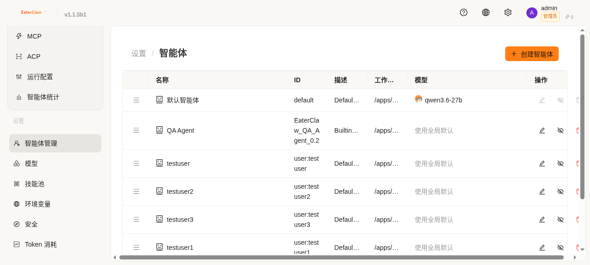

# CoApis 模块帮助

## 📋 目录

- [聊天模块](#聊天模块)
- [控制模块](#控制模块)
  - [频道](#频道)
  - [会话](#会话)
  - [定时任务](#定时任务)
  - [心跳](#心跳)
- [工作区模块](#工作区模块)
  - [我的空间](#我的空间)
  - [技能](#技能)
  - [工具](#工具)
  - [MCP](#mcp)
  - [ACP](#acp)
  - [运行配置](#运行配置)
  - [智能体统计](#智能体统计)
- [设置模块](#设置模块)
  - [智能体管理](#智能体管理)
  - [模型](#模型)
  - [技能池](#技能池)
  - [环境变量](#环境变量)
  - [安全](#安全)
  - [Token 消耗](#token-消耗)
  - [备份](#备份)
  - [语音转写](#语音转写)
  - [调试](#调试)
  - [进化](#进化)
  - [跨 Agent 进化](#跨-agent-进化)
  - [系统监控](#系统监控)
  - [SSO 集成](#sso-集成)
  - [技能市场](#技能市场)

---

## 聊天模块


聊天模块是 CoApis 的核心交互界面，支持：

### 功能特性

- **多 Agent 切换**：通过下拉菜单切换不同的 Agent
- **模型选择**：为每个 Agent 选择不同的 LLM 模型
- **实时流式输出**：SSE 流式传输，实时显示回复
- **快捷指令**：
  - `↑↓` 浏览历史消息
  - `/` 快捷指令
  - `/approve` 审批通过
  - `/deny` 审批拒绝
- **附件上传**：支持文件、图片等附件
- **语音输入**：支持语音转文字输入（需配置语音转写服务）

### 使用技巧

1. **新聊天**：点击 `+` 按钮创建新对话
2. **搜索历史**：点击搜索图标查找历史对话
3. **历史消息**：点击历史图标查看消息记录
4. **快捷指令**：输入 `/` 查看可用指令列表

---

## 控制模块

### 频道

**路径**：控制 → 频道

频道模块管理 CoApis 与外部平台的连接：

- **WeCom（企业微信）**：接入企业微信机器人
- **DingTalk（钉钉）**：接入钉钉机器人
- **Slack**：接入 Slack 机器人
- **Telegram**：接入 Telegram 机器人
- **Webhook**：自定义 Webhook 接入

#### 配置步骤

1. 点击"添加频道"
2. 选择平台类型
3. 填入平台提供的配置信息（如 Token、Secret 等）
4. 测试连接
5. 保存配置

### 会话

**路径**：控制 → 会话

会话模块管理所有活跃的对话会话：

- **会话列表**：查看所有活跃会话
- **会话详情**：查看会话完整记录
- **会话管理**：暂停、恢复、结束会话
- **会话统计**：会话数量、消息数量统计

### 定时任务

**路径**：控制 → 定时任务

定时任务模块支持 Cron 表达式，实现自动化任务：

#### 功能特性

- **Cron 表达式**：支持标准 Cron 语法
- **任务列表**：查看所有定时任务
- **任务创建**：创建新的定时任务
- **任务管理**：启用、暂停、删除任务
- **执行历史**：查看任务执行记录

#### Cron 表达式示例

```
# 每天凌晨 2 点执行
0 2 * * *

# 每周一上午 9 点执行
0 9 * * 1

# 每 30 分钟执行一次
*/30 * * * *

# 每工作日 9:00-18:00 每小时执行
0 9-18 * * 1-5
```

### 心跳

**路径**：控制 → 心跳

心跳模块监控 Agent 运行状态：

- **心跳检测**：定期检查 Agent 是否正常运行
- **状态监控**：实时监控 Agent 健康状态
- **异常告警**：Agent 异常时发送告警通知
- **自动恢复**：支持异常后自动重启 Agent

---

## 工作区模块

### 我的空间


我的空间是用户的个人文件管理区域：

#### 功能特性

- **文件上传**：支持多种文件格式上传
- **文件下载**：下载已上传的文件
- **文件管理**：重命名、删除、移动文件
- **文件夹管理**：创建、删除文件夹
- **文件搜索**：按名称搜索文件
- **版本管理**：支持文件版本历史
- **409 覆盖确认**：上传同名文件时弹出确认对话框

#### 用户隔离

每个用户拥有独立的文件空间，用户间文件完全隔离：

- `admin` 只能看到 `admin` 的文件
- `testuser` 只能看到 `testuser` 的文件

### 技能


技能模块管理 Agent 可用的技能：

#### 功能特性

- **技能列表**：查看所有已安装技能
- **技能详情**：查看技能说明、触发条件
- **技能启用/禁用**：控制技能是否可用
- **技能安装**：从技能市场安装新技能
- **技能创建**：创建自定义技能

#### 内置技能

| 技能名称 | 说明 |
|---------|------|
| `file_reader` | 读取文本文件 |
| `pdf` | PDF 文件处理 |
| `xlsx` | Excel 文件处理 |
| `docx` | Word 文档处理 |
| `pptx` | PowerPoint 演示文稿处理 |
| `browser_use` | 浏览器自动化 |
| `web_search` | 网络搜索 |
| `markitdown` | 文档转 Markdown |
| `skill-creator` | 技能创建工具 |

### 工具

工具模块管理 Agent 可用的工具：

#### 功能特性

- **工具列表**：查看所有可用工具
- **工具详情**：查看工具说明、参数
- **工具启用/禁用**：控制工具是否可用
- **工具配置**：配置工具参数

#### 内置工具

| 工具名称 | 说明 |
|---------|------|
| `execute_shell_command` | 执行 Shell 命令 |
| `read_file` | 读取文件 |
| `write_file` | 写入文件 |
| `edit_file` | 编辑文件 |
| `grep_search` | 搜索文件内容 |
| `glob_search` | 搜索文件 |
| `browser_use` | 浏览器控制 |
| `desktop_screenshot` | 桌面截图 |
| `view_image` | 查看图片 |
| `view_video` | 查看视频 |
| `send_file_to_user` | 发送文件给用户 |
| `get_current_time` | 获取当前时间 |
| `memory_search` | 搜索记忆 |

### MCP

MCP（Model Context Protocol）模块管理 MCP 客户端连接：

#### 功能特性

- **MCP 客户端配置**：配置 MCP 服务器连接
- **连接测试**：测试 MCP 连接是否正常
- **工具发现**：自动发现 MCP 服务器提供的工具
- **工具调用**：通过 MCP 协议调用外部工具

#### 配置示例

```json
{
  "name": "my-mcp-server",
  "transport": "stdio",
  "command": "npx",
  "args": ["-y", "@modelcontextprotocol/server-filesystem", "/path/to/dir"]
}
```

### ACP

ACP（Agent Communication Protocol）模块管理 Agent 间通信：

#### 功能特性

- **Agent 发现**：发现其他可用 Agent
- **消息发送**：向其他 Agent 发送消息
- **会话管理**：管理跨 Agent 会话
- **上下文传递**：在 Agent 间传递上下文

### 运行配置

运行配置模块管理 Agent 的运行参数：

#### 功能特性

- **模型配置**：选择 LLM 模型
- **Provider 配置**：选择 LLM 服务提供商
- **记忆配置**：启用/禁用记忆模块
- **工具调用配置**：配置工具调用方式
- **温度参数**：调整生成随机性
- **最大 Token 数**：设置最大响应长度

### 智能体统计

智能体统计模块提供 Agent 运行统计信息：

#### 统计维度

- **消息统计**：发送/接收消息数量
- **Token 统计**：输入/输出 Token 数量
- **工具调用统计**：各工具调用次数
- **会话统计**：活跃/总会话数量
- **性能统计**：平均响应时间、成功率

---

## 设置模块

### 智能体管理



智能体管理模块管理所有 Agent：

#### 功能特性

- **Agent 列表**：查看所有 Agent
- **Agent 创建**：创建新 Agent
- **Agent 配置**：编辑 Agent 参数
- **Agent 启用/禁用**：控制 Agent 是否可用
- **Agent 删除**：删除不需要的 Agent

### 模型

模型模块管理可用的 LLM 模型：

#### 功能特性

- **模型列表**：查看所有可用模型
- **模型配置**：配置模型参数
- **模型测试**：测试模型是否可用
- **模型选择**：为 Agent 选择模型

### 技能池

技能池模块管理全局可用技能：

#### 功能特性

- **技能列表**：查看全局技能
- **技能安装**：安装新技能
- **技能卸载**：卸载不需要的技能
- **技能更新**：更新已安装技能

### 环境变量

环境变量模块管理系统环境变量：

#### 功能特性

- **变量列表**：查看所有环境变量
- **变量创建**：创建新环境变量
- **变量编辑**：编辑环境变量值
- **变量删除**：删除不需要的变量

### 安全

安全模块管理系统安全设置：

#### 功能特性

- **审计日志**：查看所有操作日志
- **权限管理**：管理用户权限
- **IP 白名单**：配置访问 IP 白名单
- **密码策略**：配置密码强度要求
- **会话超时**：配置会话超时时间

### Token 消耗

Token 消耗模块统计 Token 使用情况：

#### 统计维度

- **按用户统计**：各用户 Token 消耗
- **按 Agent 统计**：各 Agent Token 消耗
- **按模型统计**：各模型 Token 消耗
- **按时间统计**：日/周/月 Token 消耗趋势

### 备份

备份模块管理系统数据备份：

#### 功能特性

- **手动备份**：手动创建备份
- **自动备份**：配置自动备份计划
- **备份恢复**：从备份恢复数据
- **备份管理**：查看、删除备份文件

### 语音转写

语音转写模块配置语音识别服务：

#### 功能特性

- **服务配置**：配置语音识别服务
- **语言选择**：选择识别语言
- **模型选择**：选择转写模型
- **测试转写**：测试转写功能

### 调试

调试模块提供开发调试工具：

#### 功能特性

- **API 测试**：测试 API 接口
- **日志查看**：查看系统日志
- **性能分析**：分析系统性能
- **错误追踪**：追踪错误信息

### 进化

进化模块管理 Agent 智能进化：

#### 功能特性

- **进化记录**：查看进化历史
- **知识沉淀**：查看沉淀的知识
- **技能晋升**：查看晋升的技能
- **进化配置**：配置进化参数

### 跨 Agent 进化

跨 Agent 进化模块管理多 Agent 间知识共享：

#### 功能特性

- **共享知识**：在 Agent 间共享知识
- **知识同步**：同步知识到所有 Agent
- **进化协作**：多 Agent 协作进化

### 系统监控

系统监控系统运行状态：

#### 监控维度

- **CPU 使用率**
- **内存使用率**
- **磁盘使用率**
- **网络流量**
- **服务状态**
- **请求延迟**

### SSO 集成

SSO 集成模块配置单点登录：

#### 支持平台

- **OAuth 2.0**
- **SAML 2.0**
- **LDAP/AD**
- **企业微信**
- **钉钉**

### 技能市场

技能市场模块提供技能发现与安装：

#### 功能特性

- **技能浏览**：浏览可用技能
- **技能搜索**：搜索特定技能
- **技能安装**：一键安装技能
- **技能评价**：查看技能评价

---

**返回**：[帮助文档首页](../README_zh.md)
