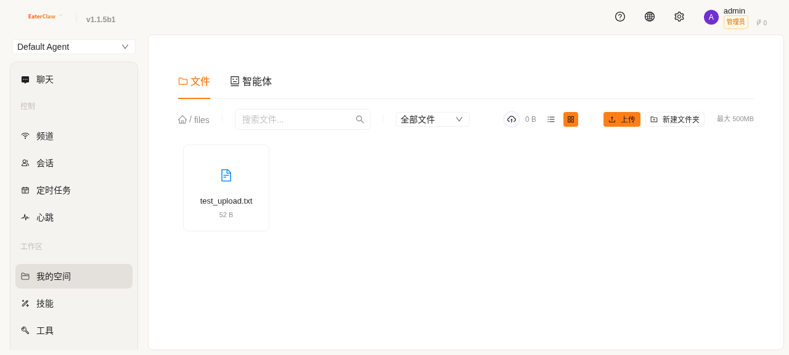
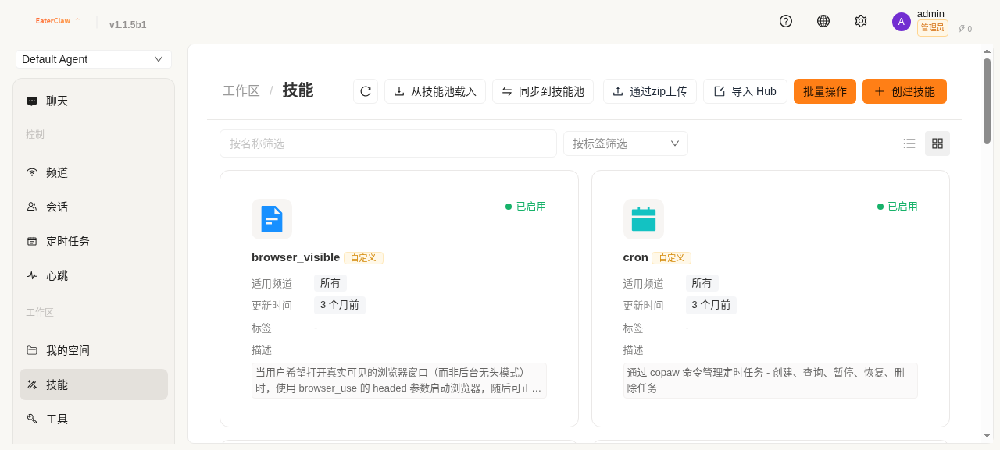

# CoApis — 你的团队，值得拥有自己的 AI 助手

> 一句话：CoApis 让整个团队共用一个聪明的 AI 助手，数据完全留在自己服务器上。

---

## 🐝 这是什么？

CoApis 是一个**私有化部署的 AI 协作平台**。

想象一下：你在自己的服务器上部署了一个 AI 助手，全公司的人都能用它——写方案、查资料、分析数据、处理文档。每个人的对话、文件、记忆完全隔离，互不干扰。

**关键区别：** 不是每个人都去开 ChatGPT 账号，而是公司有一个"自己的 AI"，7×24 小时在线，越用越懂你的业务。

---

## 💡 为什么需要它？

### 痛点

- 🔒 **数据安全**：用 ChatGPT/Claude，公司数据全部传到国外服务器
- 💸 **成本失控**：每人一个账号，费用不好控制
- 🧠 **没有记忆**：每次对话都是全新的，上次聊的全忘了
- 🔧 **不好管理**：没法统一管理权限、用量、审计
- 📱 **工具割裂**：在微信聊天，又要去网页找 AI，来回切换

### CoApis 怎么解决

| 痛点 | CoApis 的答案 |
|------|--------------|
| 数据外泄 | **完全私有化部署**，数据不出公司网络 |
| 成本失控 | **Token 配额管理**，按角色分配用量 |
| 没有记忆 | **四层记忆体系**，越用越懂你 |
| 不好管理 | **企业级权限**，审计日志全记录 |
| 工具割裂 | **接入企业微信/钉钉**，在日常工具里直接对话 |

---

## ✨ 核心亮点（30 秒看懂）

### 🏢 全团队共享，每人独立空间
不是每人一个 AI，而是**一个 AI 服务所有人**。但你的对话、你的文件、你的偏好，只有你自己能看到。

### 🧠 越用越聪明
普通 AI 每次对话都"失忆"。CoApis 的 AI 有四层记忆——记得你上次聊了什么，知道你的工作习惯，从每次交互中自动学习。**时间越久，它越懂你。**

### 🌱 自己会长新技能
AI 发现你反复做同一件事？它会**自动创建一个新技能**来处理。用得好的自动升级，用不好的自动淘汰。

### 🛡️ 企业级安全
七层安全防护——危险操作弹窗确认、异常行为自动封禁、所有操作可审计追溯。**数据完全在你自己的服务器上。**

### 📱 接入你的日常工具
不只是网页聊天。可以接入**企业微信、钉钉、Slack、Telegram**，在你天天用的工具里直接和 AI 对话。

### 🌍 中英日俄四语言
界面右上角一键切换，国际团队也能用。

---

## 🚀 5 分钟上手

```bash
# 一行命令，搞定部署
curl -fsSL https://raw.githubusercontent.com/coapis/coapis/main/install.sh | bash
```

然后打开浏览器访问 `http://你的服务器IP:4200`，用 `admin / admin123` 登录。

**就这样。** 不用装任何客户端，不用配任何环境。Docker 帮你搞定一切。

---

## 📸 看看长什么样

| 界面 | 说明 |
|------|------|
|  | 多语言登录页面 |
|  | 聊天主界面 — 多 Agent 切换、实时对话 |
|  | 个人文件管理 — 完全隔离 |
|  | 技能管理 — 看 AI 会什么 |

---

## 🎯 谁适合用？

| 角色 | 怎么用 |
|------|--------|
| 🏢 **企业管理者** | 统一管理 AI 用量、权限、审计，成本可控 |
| 💼 **团队负责人** | 为团队搭建专属 AI 知识助手 |
| 👨‍💻 **研发人员** | 代码审查、文档生成、问题排查 |
| 📊 **数据分析师** | 自动数据分析、报告生成 |
| 🎧 **客服团队** | 7×24 小时智能客服 |
| 🔧 **运维人员** | 智能监控、故障诊断 |
| 📝 **行政/HR** | 公文撰写、政策解读、流程查询 |

---

## 💰 怎么收费？

| 版本 | 价格 | 适合 |
|------|------|------|
| **开源版** | 免费 | 小团队试用 |
| **入门版** | ¥799/月 | 10 人以内团队 |
| **专业版** | ¥2,999/月 | 200 人以内，集群部署 |
| **企业版** | 定制报价 | 大型组织，完全定制 |

> 开源版功能完整，只是没有集群部署和企业级支持。小团队直接用开源版就够了。

---

## 🤔 常见疑问

**Q：和直接用 ChatGPT 有什么区别？**
> ChatGPT 是个人工具，数据在 OpenAI 服务器上。CoApis 部署在你自己服务器上，数据不出门，团队共享，还有记忆和权限管理。

**Q：需要懂技术才能用吗？**
> 使用完全不需要。部署只需要一行 Docker 命令。管理员配置好后，普通用户打开浏览器就能用。

**Q：支持哪些 AI 模型？**
> 任何 OpenAI 兼容的模型都行——OpenAI、Ollama、vLLM、LM Studio、阿里云通义千问等。你也可以用自己的私有模型。

**Q：数据安全有保障吗？**
> 数据完全在你自己的服务器上，不会发送到任何第三方。七层安全防护 + 完整审计日志。

---

**了解更多：**
- [核心优势详解](./02-核心优势.md)
- [适用场景](./03-适用场景.md)
- [竞品对比](./04-竞品对比.md)
- [安装指南](../help/02-安装部署.html)
